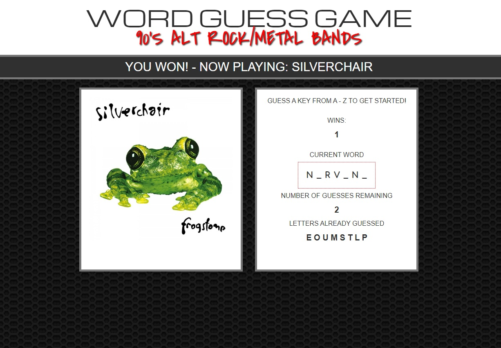

# WORD GUESS GAME

## 90's Alt Rock/Metal Bands Theme :guitar: :metal:

## Built With;

- HTML5
- CSS3
- JavaScript

## 

## Game displays the following:

- Wins: (# of times user guessed the word correctly).
- If the word is madonna, display it like this when the game starts: \_ \_ \_ \_ \_ \_ \_.
- As the user guesses the correct letters, reveal them: m a d o \_ \_ a.
- Number of Guesses Remaining: (# of guesses remaining for the user).
- Letters Already Guessed: (Letters the user has guessed, displayed like L Z Y H).
- After the user wins/loses the game automatically chooses another word.
- Song is played when the user guesses their word correctly.

## link to play the game:

https://mg1982.github.io/Word-Guess-Game/
